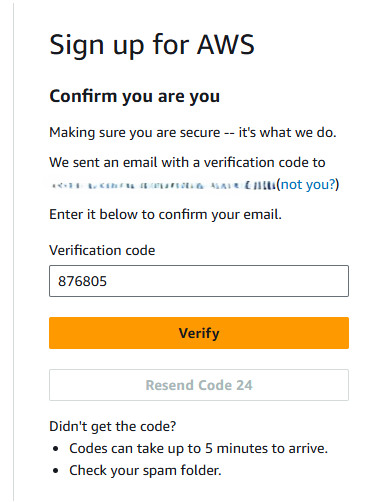
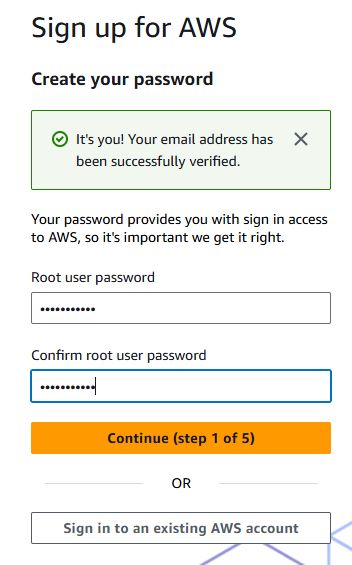
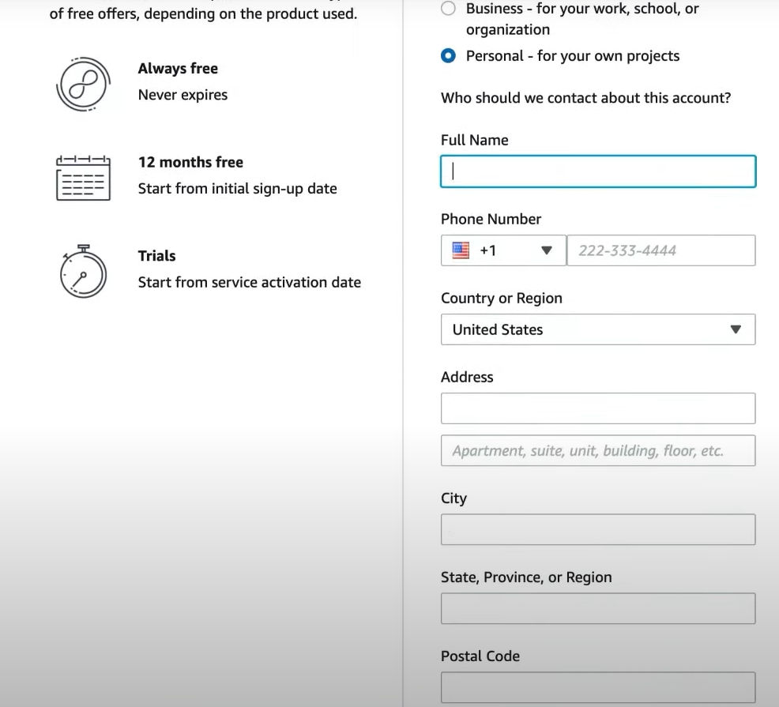
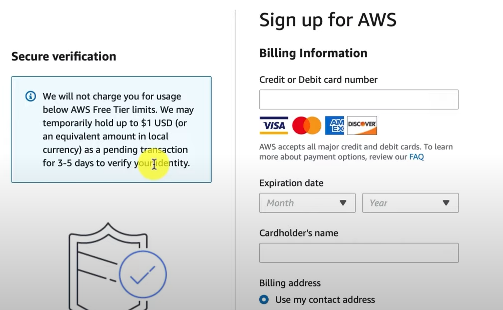
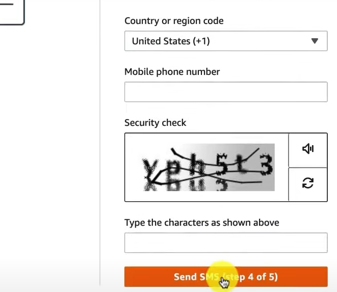
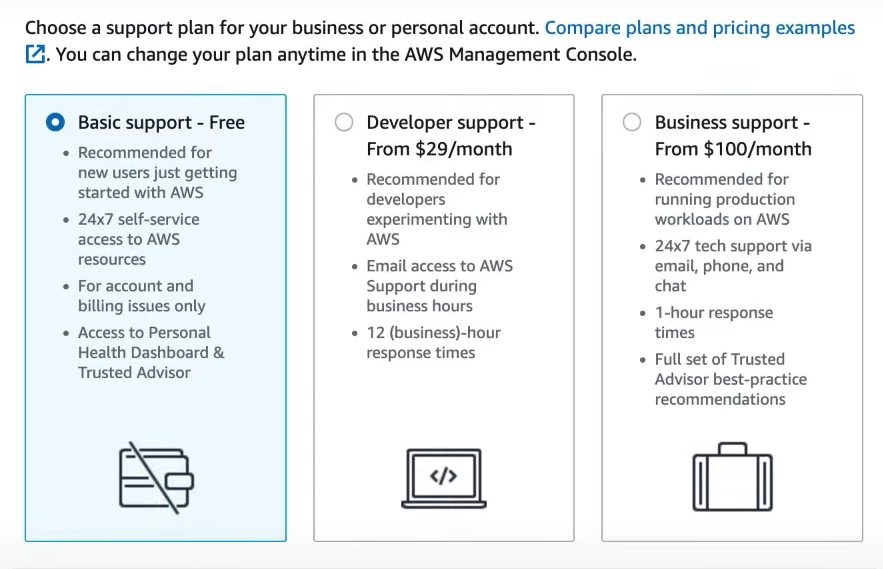

# AWS Account Creation

AWS account is simply a container to keep your resources, security groups, IAM users, roles, etc. Resources refers to all the services you use in the AWS. These include things like EC2 instances, S3 buckets, etc. 

When you create an AWS account, you need to provide information such as account name, a unique email address and a credit card. The email address you use for creating an account is used as a root user for that account. Once created, you will only have one account user which is this root user. You can also create multiple different accounts to access AWS account once created. This root user has access to everything within the account. It cannot be restricted to specific resources like you can with other users. This is the reason why you should avoid using root account for general activities on AWS because if this user is compromised, your AWS account resources can be deleted by some malicious actor and you will lose everything you've built.

The credit card information you've provided becomes the account payment method by default. The resources you created are billed to AWS account payment method depending on the consumption of those resources. You can change the payment method at any time. AWS resources are charged on a pay as you go basis. So, if you're using a resource for few hours, you will be charged only for those hours depending on the base cost. Some resources also have a monthly free quota where you can use certain amount of resources for free every month which means you pay nothing unless you exceed those quota.

Now, I've mentioned not to use root user to access your AWS account. Then you might wonder how do you access AWS? AWS provides a service called IAM (Identity and Access Management) which can be used to create new identities. Here, identities means an entity which can access resources on an AWS account. These can be a user, group or some other service which can access other services. I will explain more about these in the later sections of these lessons. You can create users, groups and roles in IAM and can provide full or limited set of permissions on your AWS account. Any identity you create will by default have no permissions on AWS account. You will have to explicitly provide permissions to these identities. This way if one of these accounts is leaked, your full AWS account is not compromised. Only the services which the user had access to might be affected. You can also revoke permissions from these users to restrict access for compromised users.

Let's set up AWS Free account.

## Set up AWS Free Account

Navigate to [AWS Console Signup](https://signin.aws.amazon.com/signup?request_type=register) page and fill in information such as root email aaddress and the AWS account name. This account name is what you will have on the top right corner to identify each individual account so give it meaningful name.

Next, click **Verify email address**. This will prompt you with Captcha code which you can enter and verify that you're a human and not a bot. This will send you a one time code on the email address you provided and you will have to enter that code in the next screen as shown below.

The next step is to enter root account password. You will have to enter strong password which is difficult to track and it's advisable to make it random or generate one using password manager and enter in the two password text inputs.

Next, you will be asked for your personal contact information. In the account type, choose personal and provide the contact information including the phone number. 

Once you accept the terms and click **Continue**, you will get to the page where you will provide your Billing Information. Do not worry about getting charged, they just need billing information to be verified but they will not charge you any amount. At most, they will keep $1 payment as pending payment for couple of days just to verify that the billing information you provided is legitimate and not something made up. So, go ahead and provide your credit card information and Billing address.

In the next lessons, I will explain you how to set up AWS Billing Alerts so that you get notified if your AWS bill goes above certain threshold. This is to make sure you do not unnecessarily get billed.

Next, you will be required to confirm your identity with a phone number. So, provide your phone number and enter the captcha code provided below. This will send you a text message which you need to enter in the textbox on the next screen.

As a last step, you will have to choose your support plan. This is where you will choose **Basic Support - Free** out of those three choices. If you're using AWS in production, it's recommended to go with Business support plan. Once you've selected, you can click **Complete Sign Up** button.

With this, you will be greeted with a message saying that you've successfully signed up with AWS. You can now navigate to AWS Management Console and login using your root credentials.

