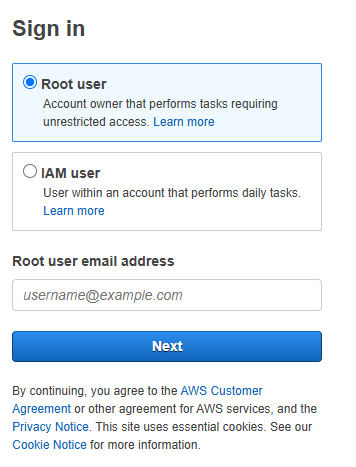
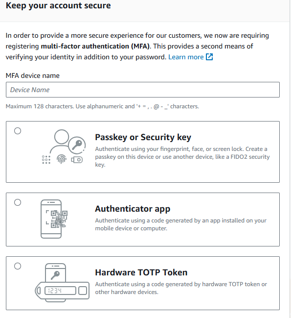
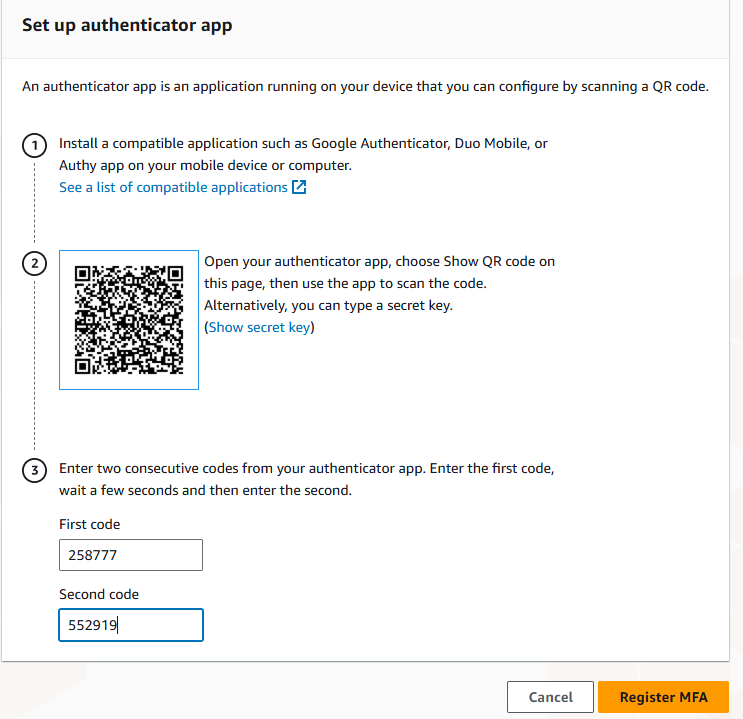
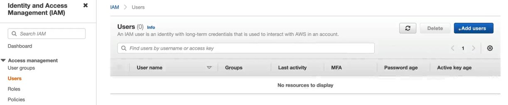
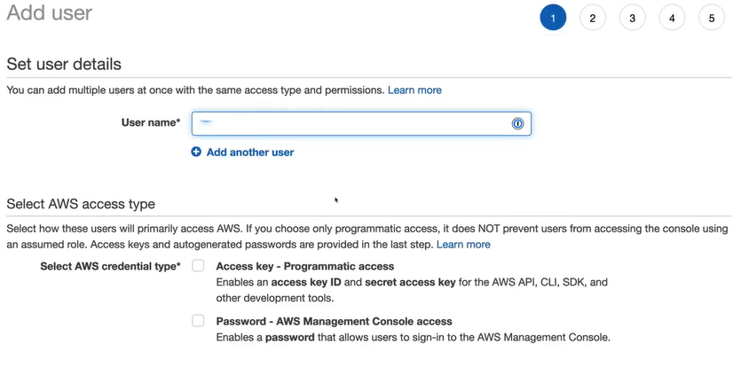
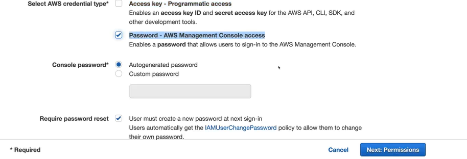
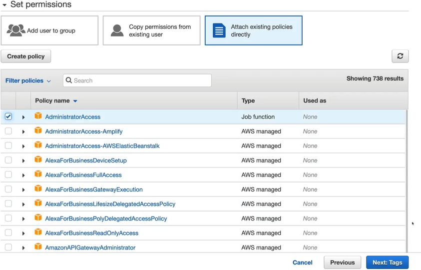
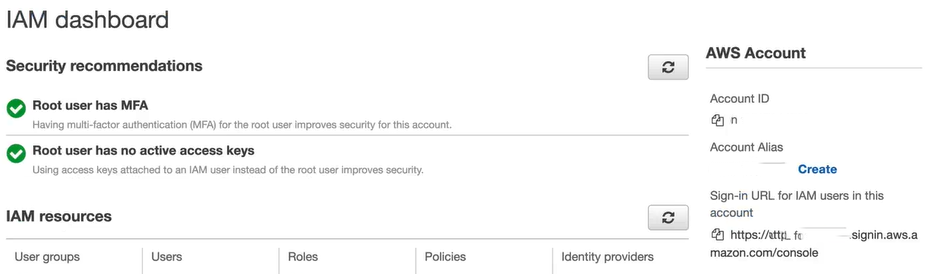

# AWS Account Creation

AWS account is simply a container to keep your resources, security groups, IAM users, roles, etc. Resources refers to all the services you use in the AWS. These include things like EC2 instances, S3 buckets, etc. 

When you create an AWS account, you need to provide information such as account name, a unique email address and a credit card. The email address you use for creating an account is used as a root user for that account. Once created, you will only have one account user which is this root user. You can also create multiple different accounts to access AWS account once created. This root user has access to everything within the account. It cannot be restricted to specific resources like you can with other users. This is the reason why you should avoid using root account for general activities on AWS because if this user is compromised, your AWS account resources can be deleted by some malicious actor and you will lose everything you've built.

The credit card information you've provided becomes the account payment method by default. The resources you created are billed to AWS account payment method depending on the consumption of those resources. You can change the payment method at any time. AWS resources are charged on a pay as you go basis. So, if you're using a resource for few hours, you will be charged only for those hours depending on the base cost. Some resources also have a monthly free quota where you can use certain amount of resources for free every month which means you pay nothing unless you exceed those quota.

Now, I've mentioned not to use root user to access your AWS account. Then you might wonder how do you access AWS? AWS provides a service called IAM (Identity and Access Management) which can be used to create new identities. Here, identities means an entity which can access resources on an AWS account. These can be a user, group or some other service which can access other services. I will explain more about these in the later sections of these lessons. You can create users, groups and roles in IAM and can provide full or limited set of permissions on your AWS account. Any identity you create will by default have no permissions on AWS account. You will have to explicitly provide permissions to these identities. This way if one of these accounts is leaked, your full AWS account is not compromised. Only the services which the user had access to might be affected. You can also revoke permissions from these users to restrict access for compromised users.

## Hardening an Account

There are several ways to harden your initial AWS account and I would recommend you follow these practices even if you're using your account only for learning.

### 1. Set up MFA

Each AWS account comes with the initial root user account which is used to create the AWS account in the first place. This user is considered the owner of the AWS account. You can use this account to perform any administrative activities however it's not recommended. This user has unrestricted access to all resources in the account. This user should be used only to perform specific tasks like billing, changing AWS support plan or reviewing usage reports or tax invoices. 

When logging in, you will see if you're using root credentials to login to your account. Again, this is strongly discouraged.

The first thing you will notice is that AWS recommends ways to keep your account secure by asking you to include multi factor authentication using one of the following.
1. a passkey
2. an Authenticator app
3. a Hardware TOTP token.

Next, you can pick the Authenticator app and click Next.
At this point, you will asked to Scan a QR code with your Authenticator app. There are various authenticator applications available in the market. You can use one of them and scan the QR code to setup MFA. Once you've scanned your QR code, you will have to enter two **consecutive** codes generated in the Authenticator app. This will be used to verify your identity and register this MFA application with your account.

At this point, you will get notification saying "You have successfully assigned a virtual MFA". You can click **Continue to Console** to go to AWS console.

### 2. Create Separate IAM User

Now, as mentioned above, you should never use AWS root user to perform daily administrative activities. Instead, you should create a separate user account for other administrative activities which are not related to the account creation.

In order to create new IAM admin user, navigate to the AWS IAM service. Here, you will click on **Users** and next click **Add users** button at the top right corner.

Next, choose the username which can be anything unique in your account. It doesn't need to be globally unique username.

Next, you need to choose the credential type where you will specify whether you want this user to use only AWS Management console or you also want this user to be able to access AWS services using programmatic access.

1. With Programming access, user will be able to create access key and secret access key which can be used to interact with AWS account using AWS CLI or using AWS SDK with various support languages.
2. With Console access, user will be able to login to AWS Management Console using their IAM username and password.

You can choose **AWS Management Console access**.

Once you choose the Console access, you will see futher options to set the password for this IAM user.

Here, you can also choose the password which can be either autogenerated or you can specify your custom password. Also, you can choose whether you want this IAM user to reset the password the first time they login to the account by checking the checkbox for *Require password reset*. Once you've chosen the password, click **Next**.

The next step is to assign permissions to this user. Here you have several options.
1. You can add this user to a group. This way all permissions assigned to the group will be inherited by this user.
2. You can copy permissions from existing user which is usually not recommended because it's difficult to manage multiple users.
3. You can attach existing policies to the user which means the permissions defined the policy will be applied to this user.

In this case, you don't have any existing user or group, so you can choose the third option **Attach existing policies directly** and you will see several built-in policies. Here, find the `AdministratorAccess` policy and check the box next to it. This means this managed AWS policy will be attached to this IAM user. Click **Next**.

At this page, you can add additional tags which are used to track different resources which you can skip for now and click **Next**.
At this final page, you can review your choices and click **Create user**. You will see a **Success** message once the user has been created.

#### 2.1 Create AWS Account Alias

Navigate to your IAM Dashboard. Here, at the right side in AWS account settings, you will see the AWS Account ID. This is the account ID for your AWS account. You can use this account ID to create an alias for your AWS account. Your default sign-in URL for IAM Users will be listed below this information and it will be in the format `https://<account_id>.sigin.aws.amazon.com/console`. You can use this URL to login to your IAM account using the AWS IAM User you just created. However, this is difficult to remember. This is where you can create custom alias for your AWS account which needs to be globally unique. You can click the **Create** button next to your Account alias which will allow you to create a unique alias for your AWS account. So, set this alias to something unique and click **Save Changes**.

Now onwards, you can use this account sign-in  url to login using your AWS IAM Users which have been provided AWS Management console access.

## Verify IAM User Credentials

Now that you have created your IAM User with credentials, you can navigate to the sign-in URL and use your credentials to login using the IAM User. Once you're logged in, you will see your account alias on the top right corner. Use this dropdown to see that you're logged in as an IAM User. Now, because this is also a user with `AdministratorAccess`, you need to secure this user credentials too. So, click on **Security Credentials** which will take you to the IAM access management page. Here, you need to setup MFA for this user. The MFA is set up per user for the same account. So, follow the same process as the root user to set up your MFA.

Now logout and log back in using the IAM User and verify that it asks you for your MFA code to verify your identity.