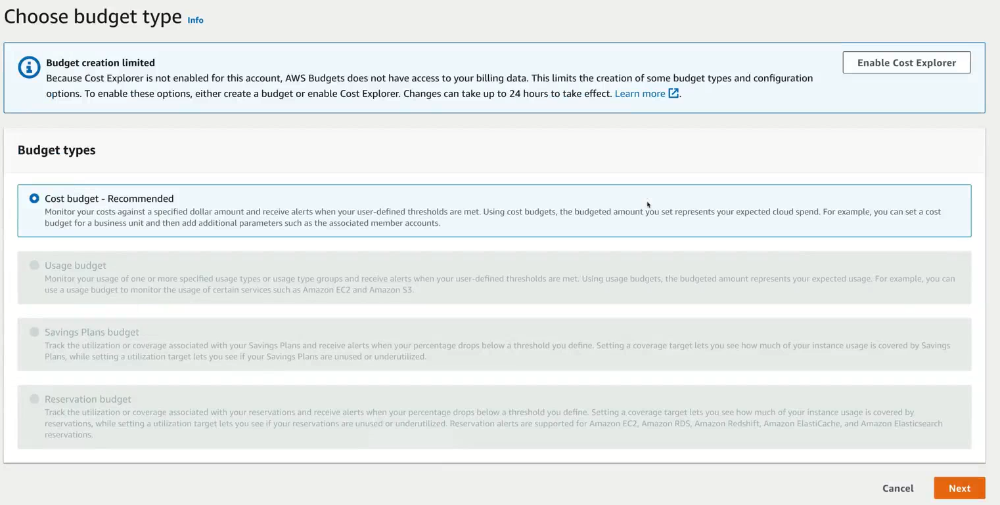
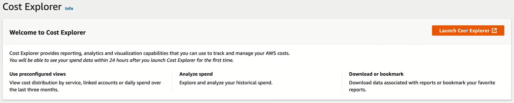

# Create Budgets

Now, in the previous lessons, you set up your own AWS Free tier account and set the MFA for secure access to your account. Assuming you signed up for a free tier account, there are certain product restrictions and/or limits within your AWS account. This means you can use specific product for specific duration of time for free, certain products are free for 12 months and few products are free to use. You can find these information on the [AWS Free Tier Overview(https://aws.amazon.com/free/)] page. Here, you can search for specific service to see the free quota offered if there is any. For example, you can see the AWS Free tier provides AWS EC2 for 750 hours per month. There are definitely limitations on what EC2 instances you can spin up while you're on free tier but it's still very good for study purposes.

## Billing Console
AWS provides number of ways for your visibility into what services or products are consuming money. If you want to be sure that you're not consuming something that's out of free tier eligibility, it's essential to set up budget in your AWS account. That way if you're storing more than what's available under free tier, you will get notified when the amount of bill exceeds the budget.

Now, in order to access budgets, you can click on your account on the top right corner and select **Billing Dashboard** from the dropdown menu. This will take you to the Billing Dashboard page. This is the central point which allows you to identify various billing options. There are three manin sections.

1. Billing: This provides information on your bills, previous payments, credits if you have any. It also provides a cost and Usage report which can be used to granularly identify the cost associated with specific product or services in your AWS account.
2. Cost Management: This is where you can explore different cost components and set up budgets for your AWS account. You can also set up Budget Reports which can help you track how your the budget you've set up is performing.
3. Preferences: This is a section where you can change your billing preferences as well as change your payment methods. Under Billing preferences, you can set up options to receive your invoices in your email, receive your usage alerts even for free tier as well as receive billing alerts.

## Setting up Budget

In order to create Budget, click on Budget from the Biling console and click **Create a budget** button. Once you click on this, you might see a warning saying that *Budget creation limited* which means you cannot create budget of various different types. In order to activate other options, you need to click on **Enable Cost Explorer**, so click on that button.

On the next screen, you may have to click on **Launch Cost Explorer** after which you might see a message asking you to check back in 24 hours if this is first time you're visiting this page.

Now as you can see above from the screen to choose budget type, there are four main types of budgets.
1. *Cost budget* helps you monitor your costs against a specified amount of dollar and receive alerts when your threshold limits are met.
2. *Usage budget* is used to monitor usage of one or more usage types.
3. *Savings Plan Budget* is used to track the use or coverage associated with your Savings Plan and receive alerts when your percentage drops below a threshold you define. You will learn about savings plan later in EC2 section of these lessons.
4. *Reservation budget* is used to track the utilization of your reservations and receive alerts when your percentage drops below a threshold limit. You will learn more about reservations in EC2 section.

In this case, I will set up Cost budget, so select that and click **Next**.

On the next screen, you can provide *Budget Name* which can be anything you feel comfortable.
In the Set budget section, set the *Period* to *Monthly* as we want to set up Monthly budget limits.
Set *budget renewal type* to *Recurring budget* and specify the *Start month* to current month.
From the dropdown for *Budgeting method*, select *Fixed* and enter your budgeted amount. Notice that this is monthly spend amount, you want to set. So, I entered 10$.
For *Budget scope*, keep *All AWS services* selected and click **Next**.

On the next page, you can set up alert thresholds. This will help you get notification, when you've spent 50% of your budget or 80% of your budget, so that you can take any action if you want to avoid extra charges. So, click on **Add an alert threshold**.

For *threshold*, choose 50% of budgeted amount and *Trigger* type to be `Actual`. This way it will trigger an alert when the actual cost is greater thann $5 because you had set budget amount to be 10$.
Next in the *Notification preferences, enter your email address or you can enter multiple email addresses by separating them with comma (`,`). Click **Next**.
On the next screen, Attach actions - Optionals, click **Next** again.
Now, review your budget information and click **Create budget**.

With this the budget has been set up for your account and it's important to know how to create budget for your account.