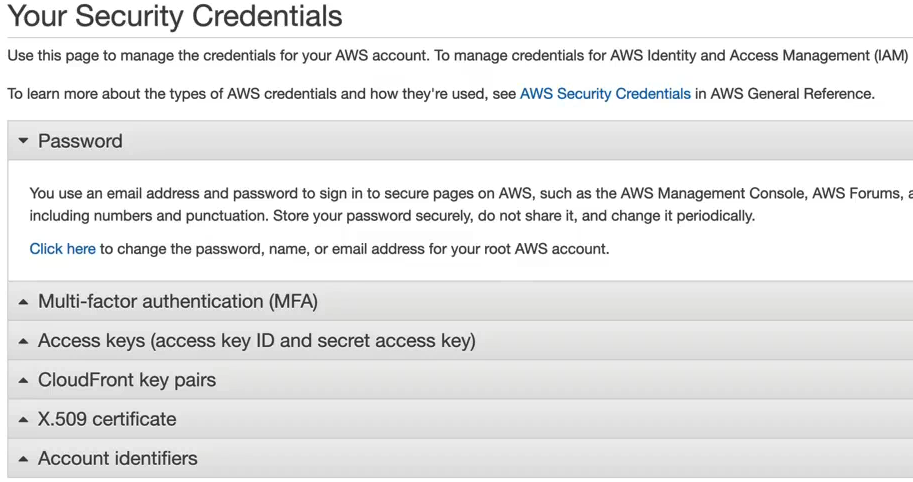
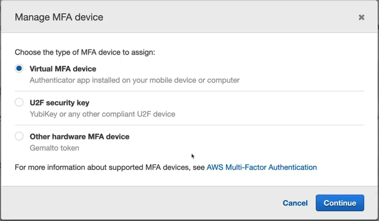
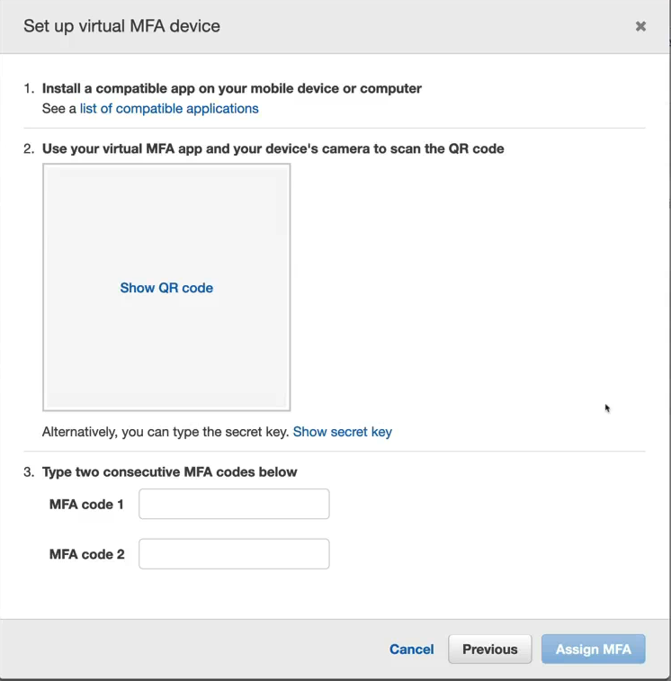

# Set Up MFA (Multi Factor Authentication) for your Account
Once you've created your account, it's necessary to protect your credentials with maximum security. This is so that you do not get charged for unnecessary resource utilization by somenoe else. For production systems, it may result in essentially damaging or destroying your whole company if your root credentials are lost. This is where multi-factor authentication comes in. 

## What is MFA?

Normally, you login using your username/email and password combinations. That's very risky if those credentials are somehow leaked to the internet. Anyone can login with your credentials to login to AWS console and use resources, but the actual bill will be charged to the billing information you provided.

Multi-factor authentication  takes into consideration more than one factor. Here, factor are different pieces of evidence which proves your identity in order to login to your AWS account. These factors can be one of the following.
- Knowledge: This is something you know. This can be username and password combinations.
- Possession: This is something that you have. This can be something like your phone device or application, a physical card, etc.
- Inherent: This is something you are. This can be proven using fingerprint, face recognition, Ratina scan or voice recognition software solutions.
- Physical Location: This can be either physical location or the network to which you're connected while accessing your AWS account.

The more factors you use for your account access, the more secure your account is. If one of the factors is compromised, you can still rely on the other factors to prove your identity correctly and avoid scammers from accessing your account.

### What is Virtual MFA

These days there are virtual MFA software that you can install in your cell phones and then use the code provided by those MFA systems along with your username and password combination. MFA applications are applications like Google Authenticator, Okta, Microsoft Authenticator, etc. This way it validates what you know (username and password) and verifies what you have (your cell phone) to prove your identity. So, even if you lose your credentials to someone, they cannot login without having the MFA code which is auto-generated and replaced every few seconds. The newer MFA applications are also protected by PIN or finger print on your device. So, there is yet another layer of security added there. This is how you will access AWS account in general in real world and is the recommended aproach by AWS. 

## Set up Virtual MFA
Let's see how you can set up MFA in your AWS account.

Once you're logged into your AWS console with your root credentials, click on the Account dropdown menu on the far top right corner and click on **Security Credentials**. With this, you will be taken to Identity and Access Management (IAM). Here, click Multi-factor Authentication (MFA) and then click **Activate MFA** button. 

This will provide different MFA device options. You can select virtual MFA device application which can be an authenticator application, a security key like Yubikey or other device or you can use hardware MFA token. The most common choice is virtual MFA device. So, choose that and click **Continue**.

On the next screen, you will all compatible applications which you can install on your phone. So, install one of the applications. These applications allow you to add an account by scanning a QR code. At this moment, on your AWS console, you will see the screen where you click on **Show QR Code** to reveal the QR code which you can scan using an Authenticator application. Once you scan your QR code, this account will be added in the authenticator application. With this, it will present you with an MFA code which changes every few seconds. You will need to enter two consecutive MFA code from this application and enter them in the AWS console to add this MFA device to your account.

Next, you can try signing out and try logging in. Verify that you're challenged to enter your MFA code during login process.