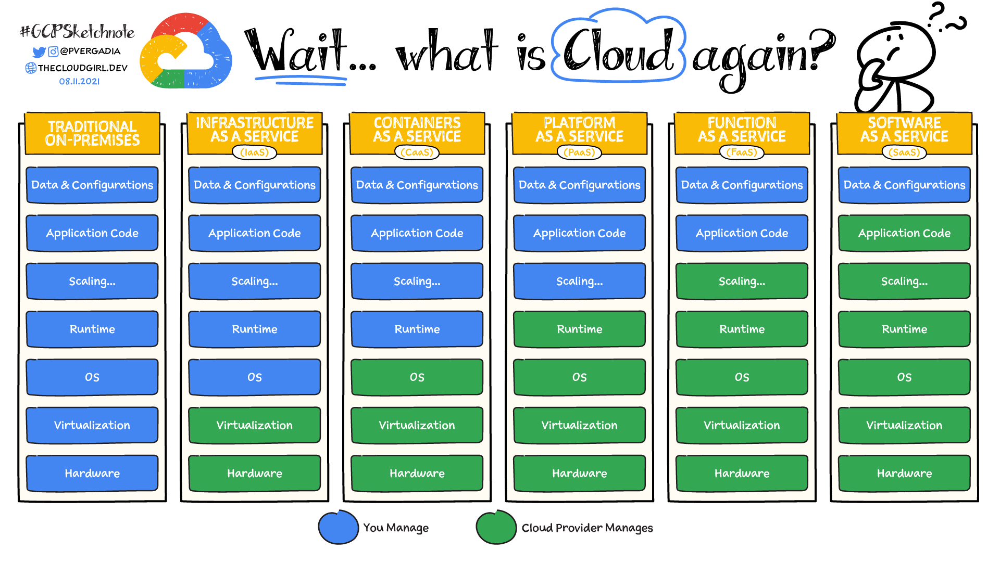

# Cloud Computing Fundamentals

## What is Cloud?

First question you should be asking is "What is cloud after all?". For some people, it may be only storage that is cloud. Like they store videos and images from their phone and can then access those pictures from any other device anywhere. However, cloud is lot more than that. Cloud is basically a remote location accessible via the internet which provides computing and storage when needed. We can store data in the cloud and it will stored somewhere on the internet and will be accessible anywhere across the world via the Internet. We can also spin up servers whenever we want in any size we want before actually signing a contract to rent server racks.

There are many companies offering Cloud services in various sizes. The major cloud providers are Google, Amazon, Microsoft, Oracle, Alibaba. There are also other small providers like Linode, Digital Ocean which provide smaller set of services but again on the cloud with on-demand access to resources. By the way resources are the computing or storage services you use or provision in the cloud.

From wikipedia definition:
> Cloud computing is the **on-demand** availability of computer system resources, especially data storage (cloud storage) and computing power, **without direct active management** by the user. Large clouds often have functions distributed over **multiple locations**, each of which is a data center. Cloud computing relies on **sharing of resources** to achieve coherence and typically uses **a pay-as-you-go model**, which can help in reducing capital expenses but may also lead to unexpected operating expenses for users.

## Why is Cloud Computing so popular?

Cloud computing provides relatively easier access to computing resources over the internet. Below are some of the advantages.

- **Cost Savings:** Businesses do not need to reserve server racks upfront. This reduces Capex (capital expenditure). Also, this means we do not need to overprovision. Usually, when business needed resources, they would have reserve those servers in data center in advance. This means usually businesses used to reserve extra capacity anticipating future growth, but sometimes those are not even needed. Cloud computing provides pay-as-you-go model which is lot more flexible. If you're using resources today, get them from cloud provider and if you're not using them, remove those. You pay only for what you used.
- **Scalability & Flexibility:** Cloud resources are lot more flexible and cloud providers have spent lots of development efforts to make the systems autoscale. So, if you need lots of resources for any special sale events like black friday, you can request more resources and use them. Once you're done with holidays season, you can deallocate those resources to reduce your cloud bills.
- **Automatic Updates:** Cloud providers are responsible for some of the managed services for OS updates, backups or patching of software systems. This reduces time spent  by SysAdmins on such tasks.
- **Security:** In cloud, security is a shared responsiblity. Cloud providers are responsible for securing the physical locations where the data is stored. They also provide several security features such as encryption at rest with other services providing encryption in transit. However, using these security measures and securing access to sensitive information is responsibility of the business. Cloud providers do provide features and options to control user, group or any other identity access, but business will have to implement them as they see fit.
- **Agility:** Smaller businesses now can scale with as little as few dollars a month to as much as millions of dollars with their business. They are not limited to having large sum of money upfront to start a business. Cloud also provides latest OS updates, machine types, software versions well before on-premise team could implement those. This makes the team lot more agile with latest software updates.
- **Global Network:** Cloud also provides global scale network. If you want to expand to different part of the world, you can simply spin up new set of resources in that region and have your business provide services in that region. Network updates and maintenance is also managed by cloud providers. Also, networking is software defined, so it's easily managed virtually.

## Characteristics of Cloud Computing

- On-demand and self-serve: You can provision resources whenever you need them and this is done through the internet. You do not need to be physically present at any data center to provision a server.
- Access Anywhere: The customers of cloud providers can access those resources over the internet from any where in the world.
- Resource Pooling: The provider has large resource of computing and storage. All users of the cloud provider share resources from this large pool. When a business requests resources, those resources are assigned to a user until they deallocate those resources. This provides economies of scale.
- Resources are Elastic and Flexible: The resources can be scaled up or down based on workload demand for the customer. They are not tied with any contract to use specific amount of resources. Instead, it's very flexible in nature which helps optimize their operating costs.
- Pay-as-You-Go Model: Cloud computing uses pay as you go model. With this model, you're charged only for the services used by the bussiness and not for anything idle. Of course, this needs some configurations on the business side but it can also be automated with autoscaling.

## Cloud History

The first commercial and wide spread cloud provider was Amazon when they launched Amazon Web services (AWS) in 2006. The initial public offering only included very basic services like EC2 or Elastic Compute Cloud. Next, around 2008, Microsoft announced Project Red Dog which was formally released as Windows Azure in 2010. This was later renamed to Microsoft Azure. Google also launched its beta version of Google App Engine in 2008 which was first public offering for developers.

Over time, these cloud providers kept adding more resources and improving performance of their services to be more market-competitive compared to other providers. There were also providers like IBM, Alibaba, Oracle which came out later in the history. However, AWS, Microsoft and Google remains the three most popular cloud service providers till date.

## Services models

All cloud providers offer their services in one of the following service models. Each of these services models provides different levels of control over the resources. So, let's understand those first before delving into further details of each of the services.

Traditional IT infrastructure consists of Data center location, networking, physical servers, virtualization, OS, runtime and application on top of this. Traditionally, companies were responsible for managing all of these. Then came service provider companies which took care of physical location of data center including cooling, security, electric supplies etc. and companies were responsible for managing all other layers.

### Infrastructure as a Service (IaaS)

In Iaas, a user needs to handle all the service configurations. This also provides lot of control over the infrastructure including computing and networking. However, with more control, the customer is responsible for more responsibility because they will need to manage the networking, computing infrastructure and storage layers etc. All of these require specialized skills which adds to costs of the team. This also means in general, Iaas might be costlier than PaaS or SaaS model. As you can see from above picture that in this case, the customer controls everything in the application stack except the underlying virtualization and the physical server racks in the data center.

Some services provided under IAAS by Google Cloud are IPs, Firewalls, Storage, Virtual Private Cloud, and Compute Engine.
### Platform as a Service (PaaS)

Platform as a service, or also known as Paas, delivers and manages all the hardware and software resources to develop applications through the cloud. In this model, developers and IT teams are not fully responsible for managing the infrastructure. The physical hardware, networking and even OS updates are managed by the cloud provider.Developers and IT operations teams can use PaaS to develop, run, and manage applications without having to build and maintain the infrastructure or platform on their own. Customers still have to write the code and manage their data and applications, but the environment to build and deploy apps is managed and maintained by the cloud service provider. 

On GCP, services like App Engine, Cloud SQL, BigQuery, Cloud Run, etc. are examples of PaaS services. The customers can provision these resources as they need them and then use them. They are not responsible for managing the physical servers.

### (Software as a Service) Saas
Software as a service, or SaaS, provides the entire application stack over the internet, delivering an entire cloud-based application that customers can access and use. SaaS products are completely managed by the service provider and come ready to use, including all updates, bug fixes, and overall maintenance. Most SaaS applications are accessed directly through a web browser, which means customers don’t have to download or install anything on their devices. They can simply access these services using their web browser.

Services like Gmail, Maps, Google workspaces are examples of Saas applications.

### (Function as a Service) Faas
There is a growing demand for serverless systems where customer can simply use the runtime to perform small tasks without having to manage the underlying server infrastructure. This type of on-demand computing usually costs less and works upto second on-demand. This has created another set of services known as Function as a service. GCP provides Cloud functions which provides a tiny environment to run small function with definite runtime. We can choose the programming environment, but other than that customer does not have much control over the infrastructure.

There is also container as a service model which will be discussed down the line.

## Types of Cloud Deployment Models

In technology industry the cloud can be deployed in one of the following ways. It can be privae cloud where everything is hosted privately, public cloud where it's accessible over the internet publicly or it can also be the middle one called hybrid cloud where some parts of application or services are accessible publicly but some parts are private.

### Private Cloud

Whenever a business requires technology that can be accessible just inside their own company and public exposure is not needed, private cloud might be a possible option. For example, if a company wants to host their intranet website for their employees to be able to collaborate design documents or even documentation, they can use private cloud. In this case, only company employees can access this website.

Interestingly, each public cloud provider also provides a solution to host private cloud solutions such as Google Anthos, Microsoft Azure Stack or AWS Outposts.

### Public Cloud

This is the most common deployment model as most customers move to cloud to use this capability. Any business offering public facing application or website can use public cloud providers to use their services as a public cloud. In this case, they create similar resources but on the public cloud and assign public IPs which can be accessible from anywhere in the world over the internet. Public Cloud services are prone to DDos attacks or other types of hacker or malware attacks. Therefore security is a major concern for any publicly accessible software applications.

### Multi Cloud
Multi cloud deployment model is usually used by large enterprise customers. This provides customers freedom to choose the best service across any of the cloud providers. For example, a customer can choose Google Dataflow for processing large datasets and can use Cosmos DB as a storage layer. This also avoids possibility of vendor lock-in and customer can choose best pricing per service. For example, Compute Engines might be better priced in GCP whereas databases might be bette priced in Azure or AWS and they can choose relevant services from each of these providers.

### Hybrid Cloud
Hybrid cloud is like a middle layer between on-premises and public cloud. Businesses can deploy internal services and applications within internal network on the private cloud or on-premises whereas public facing services can be deployed in public cloud to provide better availability and scalability. This also provides better security for internal applications with total control over those applications.

## Google Cloud Geography and Regions

Google provides high performance global network which is dedicated to Google services. Google has invested lots of money to layout lots of cables across the globe. These cables connect distinct continents across the sea. At the time of writing this document, Google has 40 regions, 121 zones and 187 edge locations across the world. Google Cloud services are available in over 200 countries and territories across the world. For more upto date information on Google cloud locations, check out their official [Global Locations](https://cloud.google.com/about/locations) page.

Now, before we move further, let's understand how Google Network is laid out across the globe.

## Regions and Zones

Regions are independent geographic locations that consists of zones. Zones and regions are simply logical abstractions of physical resources provided in one or more data centers. Google may own these data centers or those may be leased from third-party data center providers. A zone on the other hand is a deployment area for Google cloud resources within a zone. This can be considered a single failure domain within a region. To deploy application with fault-tolerance and high availability, it should be deployed in multiple zones in a region. Google Cloud intends to offer a minimum of three availability zones in every region. For example `us-west1` region has `us-west1-a`, `us-west1-b` and `us-west1-c` as three zones. It is also possible that services offered in each region might be different or they may be priced differently.

The exact location of these zones is not made public, but businesses can know approximate location of these zones. This allows them to choose the appropriate zone/region based on their user locations to reduce latency.

### Zonal Resources
Zonal resources operate within a single zone. If an outage occurs within a specific zone such as natural disaster, it can affect some of the services offered in that specific zone. Compute Engine is a very common zonal resource.

### Regional Resources
These are resources which are deployed across multiple zones within a single region. They have redundancy which provider fault-tolerance and high availability. If one of the zone experiences outage, the service will still be available and served from another zone within the same region. However, if the total region is having an outage, the service is no longer accessible.

### Multi-Regional Resources
Some of Google Cloud resources can be redundant and can be distributed even across regions. These services will have better availability compared to any regional services. These services include Bigtable, Cloud Storage, etc. These services can tolerate failure of single region.