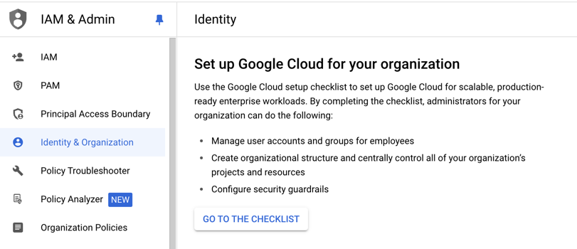

# Resource Hierarchy

Google cloud resources are the computing and storage services that you use from GCP for your business. Knowing how these resources are organized is very important in order to describe functionalities of each of them. They are also very important to know because permissions are inherited based on where permissions are assigned in the resource hierarchy.

## What is a Resource?

First of all, let's understand what is called a resource in GCP terminologies. A resource can be a service level resource used to process requests. These are services like Compute Engine, cloud storage buckets, Cloud SQL instances, Bigquery, etc. They can also be account level resources such as Organizations, folders and projects.

You had a brief intro to service level resources. Let's take a look at account level resources which consists of three levels.
1. Organization
2. Folders
3. Projects

These are organized in a hierarchical fashion using parent-child relationship. They are designed to map organizational structure on Google Cloud and helps manage access to Google cloud resources at a service level. Of course, you could set up more granular permissions but by default they are inherited. For example, in Google Cloud, permissions are controlled by Identity and Access Management (IAM) service. IAM policy assigned to the parent are inherited by child resources by default.


In this, everything from organization until project is considered as account level resources. Everything below project level is considered as service level resources.

### 1. Organization:

Organization level resource is associated with a domain. Google Workspace or Cloud identity users can create Organization level resource. Each workspace or cloud identity account is associated with one organization resource. It is usually the top level resource. So, all resources are organized under this organization level resource. As you can see from above diagram, this resource provides central visibility and control over every resource belonging to an organization.

In order to create an organization resource, you need to have a Google Workspace or Cloud Identity account. A single cloud identity is associated with a single organization. Cloud identity has super admin role which can assign the role of Organization Administrator IAM role to users who manage the organization. The users with Organization Admin role can create folders and projects. All projects and billing accounts will be children of the organization.

To set up organization, you can navigate to Google Cloud IAM & Admin service from the left navigation menu, then click on Identity & Organization. You can then create an organization resource.



### 2. Folders

Folders are just an additional layer to grouop resources as you see fit. These are optional resource organization block. You can omit having this in your account. A folder can contain other folders or projects inside it. Usually, an organization may have multiple teams and each team might be responsible for multiple products. So, they can arrange their resources organized in that fashion. For example, an ecommerce having multiple departments like finance, sales, tech etc. can have folders for each department. A folder can have exactly one parent. If tech team manages multiple different products such as data platform, web app, games, etc., they can have folders for each product.

### 3. Projects

Projects are core organization components. This is the base level organizing entity. Any resource in Google Cloud can belong to only one project. Here, resources mean service level resources such as compute engine, user principal, databases, etc. 

In Google Cloud, you will create resources under a project. Each organization will have a quota of projects it can create. You can definitely increase the quota once you reach that limit. If each product in an organization have multiple environments such as Dev, test and production. They can replicate those using different projects for each environment. In order to create a project, you need `resourcemanager.projects.create` permission which is also included in Project Creator role (roles/resourcemanager.projectCreator). You can create a project from the console or using gcloud command line tool.

From Console, you can navigate to the project selector dropdown at the top and click on New Project on the top right corner. You can then provide a project name, project ID and organization if any.


If you have permissions to create a project, you can do so using below command.

```bash
gcloud projects create <PROJECT_ID>
```

Optionally, you can pass `--organization` flag to specify the organization resource or `--folder` flag to specify the folder resource to which this project will be associated.

```bash
gcloud projects create <PROJECT_ID> --organization=<ORGANIZATION_ID>

gcloud projects create <PROJECT_ID> --folder=<FOLDER_ID>
```


Labels help categorize resources by key-value pairs. attach to any resource. organize costs when comes to billing. Everything under domain domain till project is account level resource and everything below project level is considererd service-level resource.

how policies applied in hierarchical manner